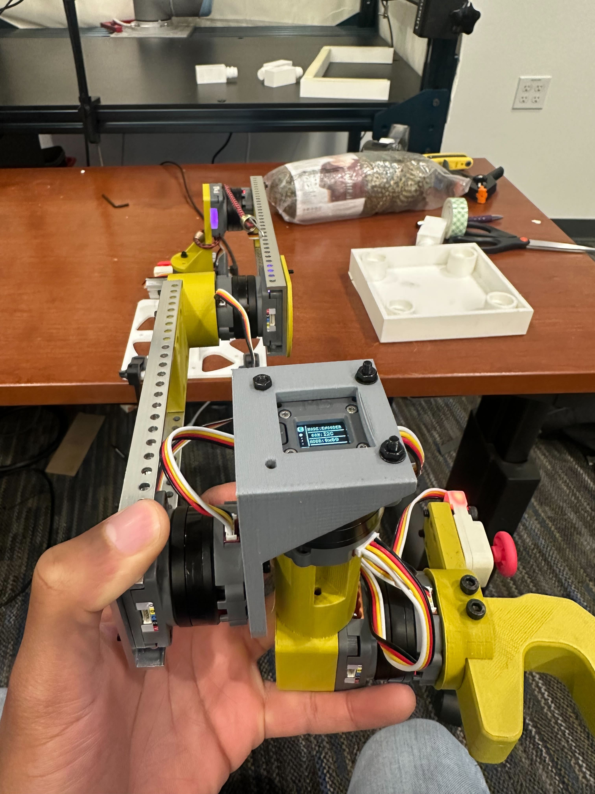
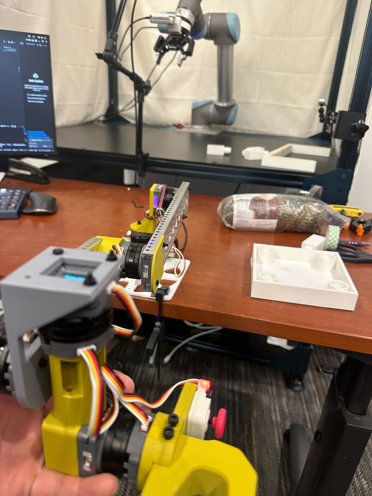
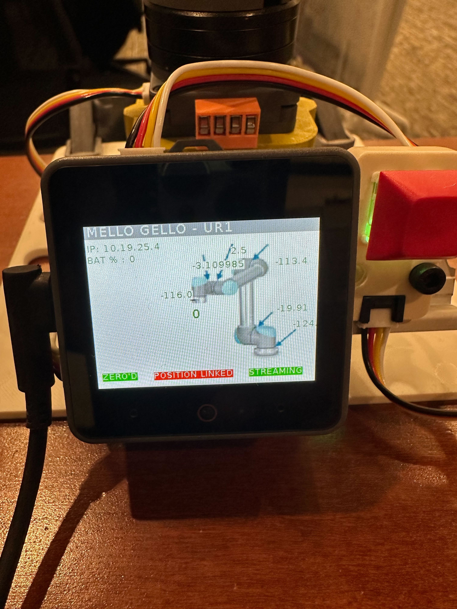

# Teleop Setup Guide

## Overview
This guide covers the setup and usage of teleoperation for the robot arm using the Mello controller.

## Mello Controller Setup

### 1. Calibrate Mello

1. Place Mello in the calibration position as shown in the images below
2. While holding it in this position, press and hold the red button for a few seconds




**Calibration Complete**: The ZERO indicator on the screen will turn green when calibration is successful.


### 2. Stream Joint Positions from Mello

1. **Unlock USB permissions**:
   ```bash
   sudo chmod 777 /dev/serial/by-id/usb-M5Stack_Technology_Co.__Ltd_M5Stack_UiFlow_2.0_24587ce945900000-if00
   ```

2. **Start streaming**: Double-tap the red button to begin streaming joint positions. The streaming indicator on the screen will turn green.



3. **Test the connection**:
   ```bash
   python tests/test_mello.py
   ```
   You should see joint positions being streamed in real-time.

## Robot Control

### Teleop the Arm
```bash
python demo_real_robot.py -o /home/patrickhaoy/research/demo/ --robot_ip 192.168.1.10
```

### Record Trajectories
- Press `c` to start recording
- Press `s` to stop recording

## Configuration

### Adjust Robot Gains
You may need to adjust the robot's performance parameters:

- **Gripper settings**: Modify `open_gripper`/`close_gripper` parameters in `diffusion_policy/real_world/real_env.py`
- **Arm gains**: Adjust the gain parameter passed to `RTDEInterpolationController` in `real_env.py`


### Train

pip install pyserial huggingface_hub==0.16.4

python scripts/prepare_sim2real_replay.py --dataset_dir ./tmp/ --output_zarr ./tmp/replay_buffer_processed 

python train.py --config-name train_mlp_sim2real_image_workspace.yaml --config-dir diffusion_policy/config task.dataset.dataset_path=./tmp/replay_buffer_processed

(Optional) accelerate launch --multi_gpu --num_processes=2 train.py --config-name train_mlp_sim2real_image_workspace.yaml --config-dir diffusion_policy/config task.dataset.dataset_path=./tmp/replay_buffer_processed

python eval_real_robot_ours.py -i /home/joshuat26/Documents/Github/diffusion_policy/data/outputs/2025.10.13/16.41.44_train_mlp_image_sim2real_image/checkpoints/epoch_0020.ckpt -o ./tmp2 --robot_ip 192.168.1.10 -j --cartesian_delta

python eval_real_robot_ours.py -i /home/joshuat26/Documents/Github/diffusion_policy/data/outputs/2025.10.13/16.41.44_train_mlp_image_sim2real_image/checkpoints/epoch_0020.ckpt -o ./tmp2 --robot_ip 192.168.1.10 -j
