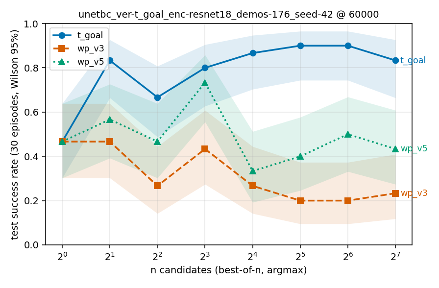
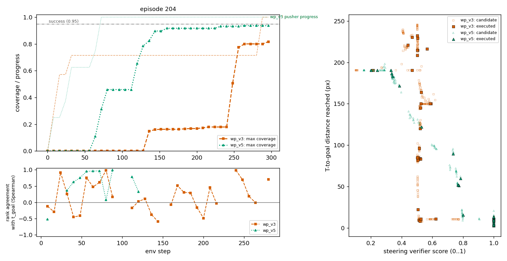
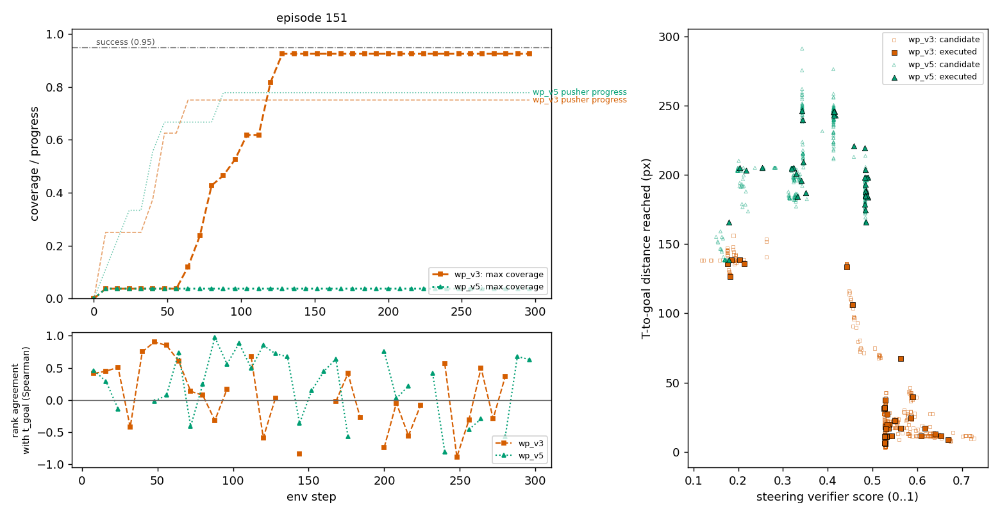

# The VLM waypoint verifiers (wp_v3, wp_v5) on PushT — 2026-09-30

**Status: complete.** One checkpoint, the 176-demo BC UNet expert at step 60k
(`unet_bc/unetbc_ver-t_goal_enc-resnet18_demos-176_seed-42`, train 176 / val 0 / test 30),
measured three ways under three verifier values: the `t_goal` baseline and the two
Veritas-tracker values `wp_v3` (pusher waypoints only) and `wp_v5` (pusher waypoints + T poses,
averaged). 27 ckpt jobs, all COMPLETED. Numbers are recorded, not selected: the 60k step was
named up front, and nothing below nominates an n or a value.

**Headline: the waypoint verifiers do exactly what they were built for and it does not help.**
They give a strict ordering to the chunks `t_goal` cannot tell apart (§2), but that ordering
is not the expert's (§1), and best-of-n under either value is flat or *falls* with n while
the tracker's own progress metric rises (§3) — the sampler is optimising the plan, not the task.

Plans: the 30 test-episode plans committed under `media/veritas_pusht/{v3_end_outside,
v5_pusher_and_t}/` (gemini-3.8-flash, one call per episode). **No Gemini call was made for
this report**; the sunk cost of those 60 plans is $0.97 (v3 $0.55, v5 $0.42, from the
`usage` recorded in each `ep*.json`).

## 1. a* rank among n=16 policy candidates

`scripts/astar_uniform_walk.py` walks the 30 test demos open-loop, one decision every Ta=8
steps (472 decisions), and at each scores 16 policy candidates, 16 uniform straight-line
chunks and the recorded expert chunk a*. Mean rank / n is 0 when a* beats every candidate;
ties count half, so 0.5 is the exchangeability null. Cluster bootstrap over episodes.

| value | decisions | a* p_best (all) | a* mean rank / n (all) | a* p_best (informative) | a* mean rank / n (informative) |
|---|---|---|---|---|---|
| t_goal | 472 | 19 [16, 22] | 0.48 [0.44, 0.52] | 24 [19, 29] | 0.48 [0.42, 0.54] |
| wp_v3 | 472 | 16 [11, 20] | 0.58 [0.53, 0.62] | 14 [9, 19] | 0.61 [0.56, 0.67] |
| wp_v5 | 472 | 20 [15, 24] | 0.51 [0.47, 0.55] | 17 [12, 22] | 0.54 [0.48, 0.60] |

Neither waypoint value ranks a* better than `t_goal`. `wp_v3` ranks it *below* the null
(0.58; 0.61 where `t_goal` is informative, CI excluding 0.5): the pusher-only plan actively
prefers non-expert chunks. Spearman(score, −distance to a*) is ≈0 for all three (−0.012,
−0.010, +0.003), so none of them steers toward the expert in the continuous sense either.

Provenance of the top pick (policy vs uniform, matched budgets, null 0.5 each):
`t_goal` 0.30 / 0.65, `wp_v3` 0.16 / 0.81, `wp_v5` 0.19 / 0.75. The waypoint values prefer
the uniform straight-line chunks over the policy's even more strongly than `t_goal` does.

## 2. NO-TOUCH: can the verifier rank chunks that never move the T?

This is the question the pusher track was added for. Under `t_goal` every non-mover scores
the current T-to-goal distance bit-for-bit. 202 decisions have ≥2 non-moving policy
candidates (mean 13 of 16); a* itself is a non-mover on 165 decisions.

| value | decisions w/ 2+ non-movers | distinct scores among non-movers | fraction ranked | a* non-touch decisions | a* p_best among non-movers | a* mean rank frac (0.5 = null) |
|---|---|---|---|---|---|---|
| t_goal | 202 | 1.00 of 13.0 | 0.00 | 165 | 0.09 | 0.50 |
| wp_v3 | 202 | 12.94 of 13.0 | 1.00 | 165 | 0.21 | 0.55 |
| wp_v5 | 202 | 11.38 of 13.0 | 0.87 | 165 | 0.22 | 0.52 |

**Yes, mechanically.** `wp_v3` gives every non-mover a distinct score on every such decision;
`wp_v5` on 87% (the T track is flat on non-movers, so only the pusher half varies). Among the
uniform chunks the mean spread is 0.07 (`wp_v3`) / 0.03 (`wp_v5`) on a 0..1 scale.

**But the ordering is not the expert's.** a* is the top non-mover 21–22% of the time
(chance ≈ 1/14 ≈ 7%), yet its mean rank fraction is 0.55 / 0.52 — at or below the null.
The verifier sometimes puts a* first and otherwise scatters it. Among non-movers the top pick
is uniform 61% / 60% of the time, policy 30% / 28%, a* 9% / 11%.

Decision frames (same three decisions under each value; colour = value, line style = source,
star = a*, ring = argmax): [`media/wp_verifier_viz/`](media/wp_verifier_viz/). In
`ep13_frame1825` the pusher is below-right of the T; `wp_v3` scores every policy candidate
that heads up-left toward waypoint 1 nearly equally (0.20–0.22) and the uniform chunks
pointing away lowest — a clean ordering by "closer to the next pin", which is not the same
as "pushes the T".

## 3. Best-of-n on the BC UNet expert, n = 1 … 128

`eval_search_pusht.py --skip-val --n-envs 30 --n-list <n>`, argmax selection, one ckpt job per
(value, n). 30 test episodes, Wilson 95% CI in brackets; ±18 points at p=0.5, so read the
trend, not adjacent cells. n=1 is identical across rows by construction (same seed, no
selection).

| value | n=1 | n=2 | n=4 | n=8 | n=16 | n=32 | n=64 | n=128 |
|---|---|---|---|---|---|---|---|---|
| t_goal | 47 [30, 64] | 83 [66, 93] | 67 [49, 81] | 80 [63, 90] | 87 [70, 95] | 90 [74, 97] | 90 [74, 97] | 83 [66, 93] |
| wp_v3 | 47 [30, 64] | 47 [30, 64] | 27 [14, 44] | 43 [27, 61] | 27 [14, 44] | 20 [10, 37] | 20 [10, 37] | 23 [12, 41] |
| wp_v5 | 47 [30, 64] | 57 [39, 73] | 47 [30, 64] | 73 [56, 86] | 33 [19, 51] | 40 [25, 58] | 50 [33, 67] | 43 [27, 61] |



Mean tracker progress at episode end (pusher / T track, 0..1), from the same rollouts:

| value | n=1 | n=2 | n=4 | n=8 | n=16 | n=32 | n=64 | n=128 |
|---|---|---|---|---|---|---|---|---|
| wp_v3 | 0.90 | 0.89 | 0.87 | 0.90 | 0.91 | 0.91 | 0.89 | 0.93 |
| wp_v5 | 0.91 / 0.88 | 0.90 / 0.89 | 0.89 / 0.89 | 0.94 / 0.87 | 0.92 / 0.86 | 0.96 / 0.94 | 0.98 / 0.89 | 0.98 / 0.93 |

- `t_goal` climbs from 47% to 83–90% by n≥8, as on every earlier BC arm.
- `wp_v3` **falls** with n: 47% → 20–27% from n=16 on, while its pusher-track progress rises
  to 0.93. Following the pusher pins more faithfully makes the episode *less* likely to
  succeed. The pins are where Gemini drew them, at one frame, with no dynamics.
- `wp_v5` is flat-to-noisy (33–73%, all CIs overlapping n=1) while both tracks reach 0.93–0.98.
  The T-pose track reports the T "at" its final pose (tolerance 2 px mean keypoint, plus the
  tracker's skip-ahead and hysteresis) on rollouts that do not reach the 95% coverage success
  needs, so a high T-track score is not a success proxy.

## 4. Cost

| | |
|---|---|
| Gemini | **$0** this report. Sunk: 60 test plans, $0.97 (v3 $0.55, v5 $0.42), 116k in / 36k out / 203k thinking tokens. |
| Compute, measured | 26 COMPLETED jobs = **10.8 GPU-h** on the ckpt partition (24 BON + 3 a* walks; the wp values cost less per n than `t_goal` because their rollouts end sooner). |
| Compute, overhead | 2.3 GPU-h: three smoke jobs and one batch of 24 jobs that died at launch (`$0` under sbatch is the spooled copy; fixed in `2015f14`). |
| Wall clock | 12:59 → 14:03 for the 27 real jobs (first job start to last job end), with gscratch reading at ~8 MB/s from the compute nodes all afternoon. |

## 5. Reproduce

```
CKPT=<run>/checkpoints/step_0060000.ckpt
unset WANDB_API_KEY
CKPT=$CKPT SUBMIT=1 bash scripts/slurm/submit_wp_bon.sh                     # 24 jobs
CKPT=$CKPT sbatch --account=robotics --partition=ckpt --array=0-2 \
    --time=4:00:00 scripts/slurm/wp_astar_walk.sbatch                       # 3 jobs
python scripts/wp_verifier_table.py --run <run> --step 60000 --fig docs/reports/media/wp_verifier_bon_step60k.png
```

Raw inputs are copied beside this page: [`summaries/from-analysis/wp_verifier_step0060000/`](summaries/from-analysis/wp_verifier_step0060000/) holds the
three `success_curve.json`s and the three a*-walk JSONs (the `analysis/` tree is gitignored).

## 6. Why success falls: closed-loop rollouts (added 2026-10-01)

Softmax selection (T = 1.0 on the z-scored candidate values) replaces argmax wherever a
waypoint value ranks; `t_goal` stays argmax. Best-of-n on the same 60k checkpoint,
success % / mean max coverage, 30 test episodes:

| value | n=1 | 2 | 4 | 8 | 16 | 32 | 64 | 128 |
|---|---|---|---|---|---|---|---|---|
| wp_v3 softmax | 47 / .94 | 30 / .90 | 47 / .94 | 47 / .89 | 50 / .94 | 47 / .87 | 40 / .87 | 30 / .85 |
| wp_v5 softmax | 47 / .94 | 43 / .91 | 50 / .90 | 37 / .90 | 23 / .90 | see curve | 30 / .90 | 37 / .90 |
| wp_v3 argmax (§3) | 47 / .94 | 47 / .86 | 27 / .77 | 43 / .88 | 27 / .83 | 20 / .73 | 20 / .71 | 23 / .69 |
| t_goal argmax (§3) | 47 / .94 | 83 / .95 | 67 / .95 | 80 / .96 | 87 / .96 | 90 / .94 | 90 / .95 | 83 / .94 |

Softmax removes the argmax collapse (coverage holds at 0.85–0.94 instead of falling to
0.69) but still gains nothing over n=1.

**Rollouts.** `scripts/render_search_videos.py --verifier-value wp_v3 --shadow-values
wp_v5,t_goal --execute softmax` on the five episodes that collapsed in §3 (149, 151, 197,
199, 204), n=16, once steered by each wp value; every candidate is also scored under the
other two values on the same state. Plots: `scripts/wp_rollout_plots.py`.

| | wp_v3-steered | wp_v5-steered |
|---|---|---|
| decisions where the 16 candidates' steering scores span < 0.01 | **66%** | **68%** |
| decisions where the plan is already complete (best score = 1.0) | 29% | 34% |
| decisions where `t_goal` separates the candidates by > 1 px | 72% | 70% |
| on those, the executed pick is the `t_goal` pick (chance 6%) | 12% | 13% |
| on those, T-to-goal px given up vs the `t_goal` pick (median / mean) | 1.7 / 3.3 | 1.6 / 4.5 |

**The waypoint verifier is blind on two thirds of decisions, and it is blind exactly
where `t_goal` is not.** The tracker score is `0.7·(pins latched / n) + 0.3·exp(−d/7.5 px)`
to the next pin. Within one 8-step chunk almost no candidate latches a new pin, and the
distance term is ≈ 0 once the pusher is more than ~20 px from that pin, so the 16
candidates get the same score to three decimals. Once the last pin is latched (about a
third of all decisions, often before the T is home — the v3 prompt places the final pin
*outside* the goal) every candidate scores 1.0 for the rest of the episode. On those
decisions selection is noise: argmax picks whichever candidate happens to be a rounding
error ahead, and softmax, which z-scores the scores first, inflates a 0.001 spread into a
full-width distribution and draws at random. `t_goal` still separates the same
candidates by pixels of T motion on 70% of decisions; the waypoint pick agrees with it
only twice as often as chance and gives up ~1.7 px of T progress per decision, which
compounds over ~35 decisions.



ep204, wp_v3-steered (orange): pusher progress reaches 0.71 by step 30 and then stays
flat until step 280 while coverage sits at 0 for 130 steps. In the scatter the executed
wp_v3 candidates form a vertical stripe at score ≈ 0.5 spanning 0–240 px of T distance:
the score carries no information about where the T goes.



ep151, wp_v5-steered (green): coverage never leaves 0.04 although pusher progress climbs
to 0.78. The contact sheet ([ep151 wp_v5](media/wp_rollout_viz/ep151_bc60k_wp_v5_sheet.png))
shows the pusher following the plan's pins around the left side of the workspace while
the T is never touched — the T-pose track cannot advance on a T that does not move, so
only the pusher half of the score varies, and it rewards walking the pins. The same
episode steered by wp_v3 reaches 0.92.

Rank agreement with `t_goal` (lower timeline panels) swings between −0.9 and +0.9
decision to decision; mean per episode +0.07 to +0.64.

**Caveat:** these rollouts reproduce the eval's seeds but not its trajectories bit for
bit — the eval job ran on an RTX 6000, the render on an A40, and the policy's
floating point differs across GPU architectures. They are the same policy, verifier,
episodes and noise seeds, so the per-decision mechanism holds; the per-episode outcomes
differ from the eval rows (e.g. ep204 0.82 here vs 1.00 in the softmax n=16 eval).
